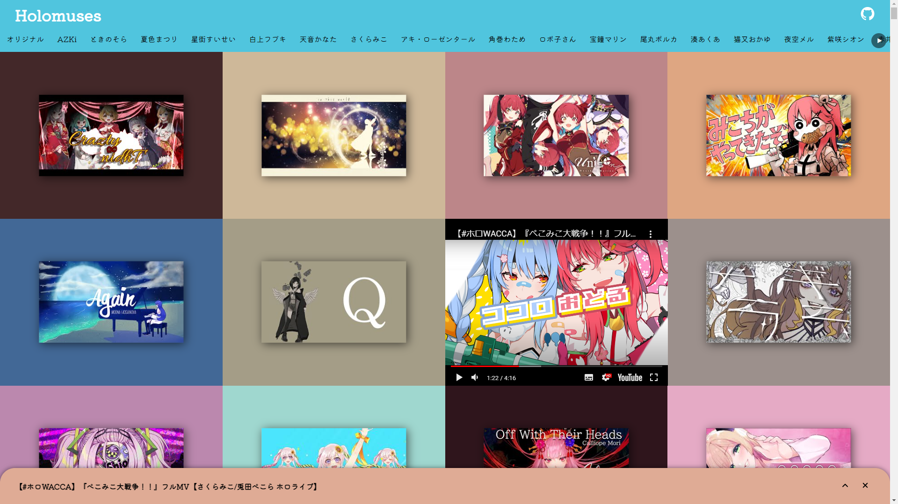

# YouTube Playlist

YouTube の動画をいい感じに並べる。

## Usage

利用には [YouTube Data API](https://developers.google.com/youtube/v3/getting-started?hl=ja) を利用するための API キーが必要です。

### project.toml

ここに、プロジェクトの情報を追加する。

- `[project]`
  - `title` : タイトル
  - `description` : HTML に書かれる説明文
  - `origin` : デプロイ先の URL オリジン
  - `ogimage` : OGP に表示させる画像(`/static` からのパス)
  - `splashimage` : ページ読み込み時に表示される画像(`/static` からのパス)
  - `color` : ヘッダなどの色
- `[[playlist]]` (複数指定可)
  - `id` : YouTube のプレイリスト ID
- `[[video]]` (複数指定可)
  - `id` : YouTube の動画 ID
- `[[ignore]]` (複数指定可)
  - `id` : プレイリストに含まれるが表示したくない動画 ID

### 開発

1. `.env.template` を `.env` にコピーし、API キーを入力する
2. `project.toml` を編集する
3. `pnpm fetch:local` で動画の情報を取得する
4. `pnpm dev` で開発サーバを立ち上げプレビュー

### デプロイ

#### GitHub

GitHub であれば GitHub Actions が設定してあります。

1. `project.toml` を編集する(`project.origin` は `https://{ORGANIZATION}.github.io`)
2. `svelte.config.js` の `config.kit.paths.base` をリポジトリ名にする
3. Settings > Secrets から Repository secrets に `API_KEY` を設定する
4. リポジトリの Actions から GitHub Pages のワークフローを実行

#### その他

`project.toml` と `svelte.config.js` を設定後、
`pnpm build` を実行すると `/.svelte-kit/static/build` にファイルが生成されるので、これを公開してください。

## Contribution

WELCOME!
